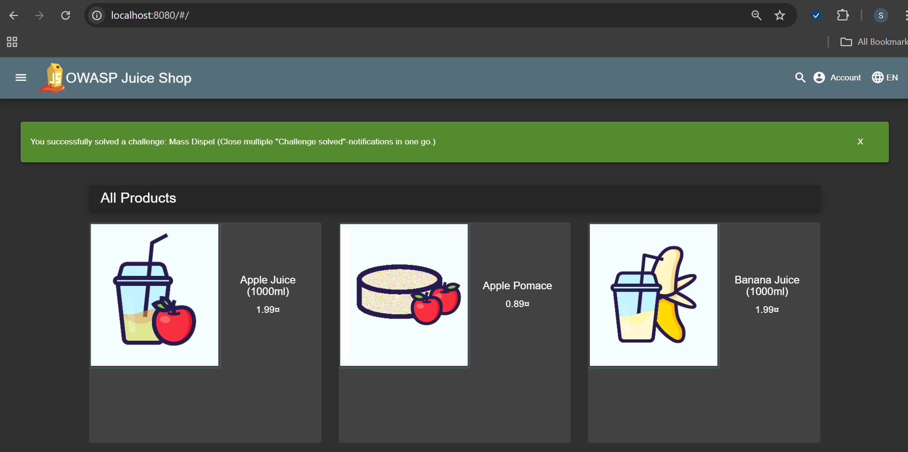
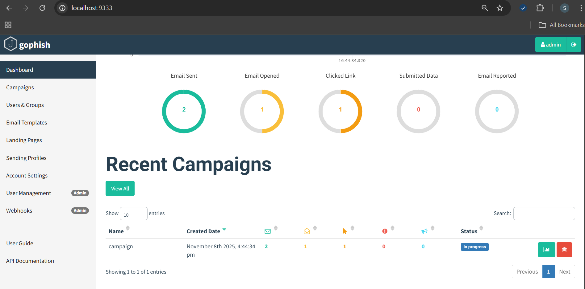
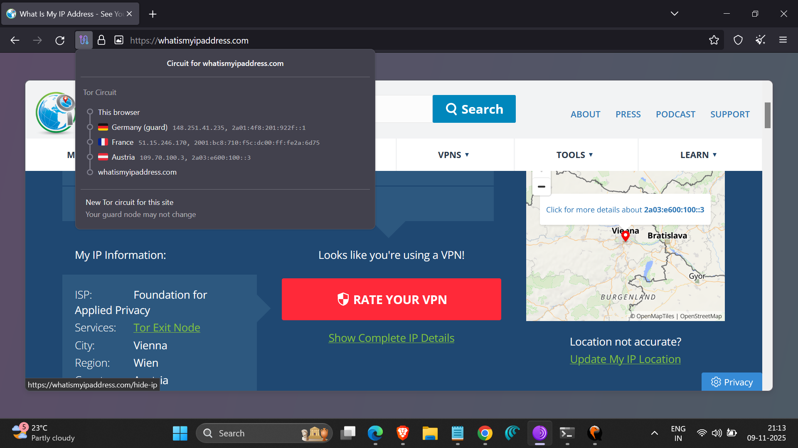

# Hands-on-Security-Simulations
Cybersecurity Workshop Report
**Trainer:** Mr. Radhe Shyam – Cybersecurity Expert  
**Duration:** 2 Days  
**Mode:** Hands-on Practical Sessions  

---

## 🧠 Overview
This workshop focused on practical cybersecurity skills through real-world attack and defense simulations.  
We deployed vulnerable applications, simulated phishing attacks, and explored online anonymity tools.

---

## ⚙️ Tools & Technologies Used
- **Quick Emulator (QEMU)** – Virtual machine deployment  
- **OWASP Juice Shop** – Web application vulnerability testing  
- **GoPhish** – Phishing simulation and awareness  
- **Tor Browser** – Anonymity and secure browsing  

---

## 🔍 Day 1: Web Vulnerabilities (OWASP Juice Shop)
- Deployed OWASP Juice Shop on a virtual machine using **Quick Emulator (QEMU)**.  
- Accessed the vulnerable web app via **port 8080** in the browser.  
- Explored and exploited **OWASP Top 10 vulnerabilities**, including:
  - Cross-Site Scripting (XSS)
  - SQL Injection
  - Broken Authentication
  - Insecure Direct Object References (IDOR)
- Learned how insecure coding practices can lead to critical security flaws.  

### 📸 Screenshot
  
*OWASP Juice Shop web interface hosted locally on port 8080.*

---

## ✉️ Day 2: Phishing Simulation (GoPhish)
- Used **GoPhish** to simulate real-world phishing campaigns.  
- Designed and sent **phishing emails** with custom landing pages.  
- Tracked **open, click, and credential capture** statistics in the GoPhish dashboard.  
- Learned attacker perspectives and the importance of **security awareness training**.  

### 📸 Screenshot
  
*GoPhish campaign tracking showing email delivery and click statistics.*

---

## 🕵️‍♂️ Session 3: Online Anonymity (Tor Browser)
- Used **Tor Browser** to understand how **onion routing** protects privacy.  
- Observed the **network hops (relays)** between user and destination.  
- Discussed **VPNs, encryption**, and **digital footprint reduction** techniques.  

### 📸 Screenshot
  
*Tor Browser showing anonymous routing hops.*

---

At the end of each session, we had a **reflection and Q&A round** where the trainer asked both technical and non-technical questions related to the previous activities. This helped us revisit key concepts, share our takeaways, and improve our communication and analytical thinking.

---

## 🎯 Key Learnings
- Understood practical web exploitation techniques and their mitigations.  
- Learned how phishing attacks are planned, executed, and analyzed.  
- Gained awareness of anonymity, encryption, and safe browsing practices.  
- Strengthened both **offensive (red team)** and **defensive (blue team)** security perspectives.  

---

## 🏁 Outcome
This workshop enhanced my **hands-on cybersecurity experience**, improved my understanding of **ethical hacking**, and provided exposure to real-world **cyber defense strategies**.

---

## 💻 Repository Info
This repository documents my learnings and practical exercises from the **2-day Cybersecurity Workshop** conducted by **Mr. Radhe Shyam**.

Feel free to explore, fork, and connect if you’re interested in similar cybersecurity practices. 🧩  

📬 **Author:** [Snehashree N](https://github.com/Snehaashree)   
🔒 **Focus Areas:** Web Security | Phishing | Anonymity | Ethical Hacking  

---

## 🗂️ Folder Structure
│
├── README.md
└── images/
├── juice-shop.png
├── gophish-dashboard.png
└── tor-browser.png
